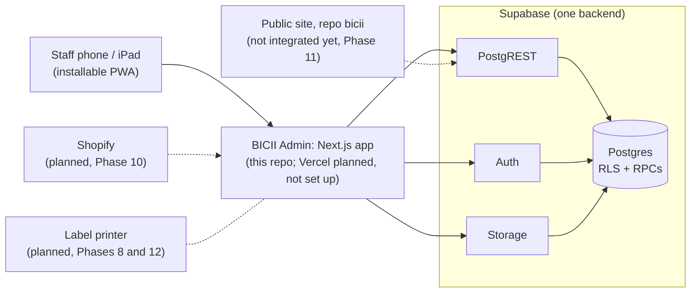

# Architecture and rationale

Owner: the build agent, reviewed by the product owner (Abhishek Cherian
George). Implementation inspected: `c6bf6d0` on 2026-10-05 (application code
identical to `b34bbcd`, the head of PR #7).

This page describes the system as it is built. The decision of record is
[ADR-001](ADR-001-architecture.md), whose body stays as written in PR #1;
where they differ on a fact (versions, for example), this page and the code
are current.

## Current system

Dashed lines are planned, not built. Nothing is deployed: there is no
hosted Supabase project and no Vercel project
([R-001](RISKS.md#r-001--nothing-is-deployed)). Locally and in CI the
Supabase services run without Docker on the devstack
([ADR-002](decisions/ADR-002-devstack.md)): Auth on :9999, PostgREST on
:3001, Storage on :5000 behind a gateway on :54321, and Postgres 16.

Installed versions (from `package.json` and `node_modules`, 2026-10-05):
`next` 16.3.8, `react` / `react-dom` 19.2.8, `@supabase/ssr` 0.12.7,
`@supabase/supabase-js` 2.117.2, `zod` 4.6.5, `decimal.js` 10.6.0, `pino`
10.4.0, `@zxing/browser` 0.2.1 (the Scan screen imports it dynamically, only
when the browser has no `BarcodeDetector` for QR codes). No QR-drawing package is installed yet (labels
are Phase 8; [R-019](RISKS.md#r-019--adr-001-names-versions-the-code-does-not-use)).

## Main workflow: add a part to a job

1. On the job page (`src/app/(staff)/jobs/[id]/page.tsx`) staff open the
   part sheet (`src/components/domain/add-part-sheet.tsx`). The form carries
   a client-made line id, which is the idempotency key.
2. The form posts to the Server Action `addPartToJob` in
   `src/app/(staff)/jobs/actions.ts`, built with `staffAction`
   ([src/lib/actions.ts](../src/lib/actions.ts)): it creates the
   RLS-scoped server client, calls `authorizeStaff` (signed-out → `/login`,
   inactive or missing permission → forbidden), takes the correlation id,
   validates the form with zod (`addPartSchema`), and runs the handler.
3. The handler calls `addPartToJob` in
   [src/lib/domain/inventory.ts](../src/lib/domain/inventory.ts), which calls
   the RPC `add_inventory_line` through PostgREST as the signed-in user.
4. `public.add_inventory_line`
   ([20261004001900_inventory_jobs.sql](../supabase/migrations/20261004001900_inventory_jobs.sql),
   replaced with the same signature by
   [20261004003400_consignment_job_parts.sql](../supabase/migrations/20261004003400_consignment_job_parts.sql)
   for consigned parts, D44; security definer) runs in one transaction: `private.require_staff()`;
   `private.lock_work_order` (the job FOR UPDATE), `private.lock_stock` (a
   per-product advisory lock) and the unit FOR UPDATE, in the global lock
   order ([DATA-MODEL §7](DATA-MODEL.md#7-inventory-movement-ledger)); a
   replay of the same line id returns the existing line
   (`private.inventory_line_replay`); `private.require_open_work_order`;
   validation (quantity, product, currency, `ownership_not_saleable` for
   customer-owned stock only, location or unit); the price is the override
   or `private.selling_price`, the cost the unit's or product's, and only
   NULL is missing (`part_price_missing`, `part_cost_missing`; D24); the
   line is inserted with the price, cost and
   `private.cult_commons_rate_at(...)` snapshotted;
   `private.record_linked_movement` writes one `job_consumption` ledger row
   (for shop stock exactly what `private.record_movement` wrote before); a
   unique unit becomes `held_for_customer` (`private.set_unit_status`) and
   its product's publication is refreshed; a `stock_consumed` event is
   written to the job's timeline.
   Consigned stock (D44, the owner's D27 change): after the unit, the
   consignment item is locked (lock order step 6; for a quantity product,
   all its active items in id order, then the oldest item whose remaining
   quantity covers the part, else `consignment_quantity_unavailable`); the
   item must be active; the cost is the agreed amount (+ a unique item's
   shop charges), the line also stores the item and
   `consignor_payout_snapshot` (the agreed amount), consigned stock never
   goes below zero (`insufficient_stock`), the movement names the item, and
   `private.refresh_consignment_item_status` runs last. Completing the job
   later marks the unit and the item sold (`work_orders_sell_held_units`);
   the consignor liability is derived from the live line on the completed
   job ([DATA-MODEL §9](DATA-MODEL.md#9-consignment)), never stored.
5. Success: the action calls `refresh()`, the sheet shows the on-hand after
   the move, and `after()` logs `{ correlationId, actor, action, outcome }`.

Failure path: a business refusal is `P0001` with a stable snake_case code
(for example `ownership_not_saleable`). The domain module maps field-level
codes to field errors; otherwise `staffAction` maps the error with
`mapDbError` ([src/lib/db-errors.ts](../src/lib/db-errors.ts)) to a safe
message, returns `{ ok: false, error, code, values }`, and the form renders
the typed values again from `ActionResult.values`. The transaction rolls
back, so nothing partial is stored. A retry with the same line id is a
replay, never a second movement.

## Component map

| Responsibility | Location | Dependency | Failure consequence |
|---|---|---|---|
| Staff screens and Server Actions | `src/app/(staff)/` (`page.tsx`, `actions.ts` per area) | domain modules, `requireStaff` | the screen or action errors; data stays consistent because the database enforces the rules |
| Sign-in | `src/app/(auth)/login/` | Supabase Auth (email + password on this branch) | staff cannot sign in |
| Session refresh and redirect | [src/proxy.ts](../src/proxy.ts) | `@supabase/ssr` | stale sessions, missing `x-request-id`; it is not the guard |
| Staff guard | [src/lib/auth/session.ts](../src/lib/auth/session.ts) (`requireStaff`, `requireAdmin`, `authorizeStaff`) | `my_staff_profile` | pages and actions refuse to run |
| Action wrapper | [src/lib/actions.ts](../src/lib/actions.ts) (`staffAction`, `ActionResult`) | zod, `db-errors`, logger | inconsistent errors or lost form values |
| Domain modules (server-only) | [src/lib/domain/](../src/lib/domain/) | RLS-scoped client, RPCs | the feature fails; rules still hold in SQL |
| Consignment (Phase 6) | [src/lib/domain/consignment.ts](../src/lib/domain/consignment.ts) (consignors, items, intake, terms, charges, returns, settlements over `list_consignors`, `consignor_statement`, `consignor_payout_details` and the step 1–2 RPCs); screens `src/app/(staff)/consignment/` (`page.tsx` with `?view=consignors\|items`, `consignors/[id]`, `items/[id]`, `actions.ts`); sheets in `src/components/domain/` (consignor, intake, charge, settlement, item controls); pure rules in [src/lib/consignment.ts](../src/lib/consignment.ts) (labels, `autoAllocate`, `allocationProblems`, `paidAtFromDate`) and [consignment-forms.ts](../src/lib/consignment-forms.ts); access mirrors `canViewConsignmentMoney` / `canViewSaleCosts` / `canRecordRefund` in [permissions.ts](../src/lib/auth/permissions.ts) (D48, D49) | RLS-scoped client; the consignment RPCs and the ledger views behind them | consignors cannot be paid or items received; owed, paid and outstanding stay correct because they are derived in SQL (D46). A consignor's totals are summed in the domain module from the item rows, which is how `reporting.consignor_ledger` defines them |
| Consigned job parts (D44) | `searchParts` in [inventory.ts](../src/lib/domain/inventory.ts) (consigned units and the FIFO-head consignment of quantity stock, D45), `loadParts` in [lines.ts](../src/lib/domain/lines.ts) (a line's consignment) | `consignor_statement` for the FIFO head and the cost preview | the part sheet does not offer consigned stock; `add_inventory_line` still applies D44 |
| Supabase clients | [server.ts](../src/lib/supabase/server.ts), [browser.ts](../src/lib/supabase/browser.ts), [service.ts](../src/lib/supabase/service.ts) | anon key + session; service-role key (server only) | no data access |
| Service-role use | [src/lib/admin/](../src/lib/admin/) (staff logins via the Auth admin API) | `SUPABASE_SERVICE_ROLE_KEY` | staff cannot be invited; bypasses RLS, so imports are restricted by ESLint |
| Error mapping | [src/lib/db-errors.ts](../src/lib/db-errors.ts) | P0001 codes, constraint names | users see the generic error |
| Logging and server errors | [src/instrumentation.ts](../src/instrumentation.ts), [src/lib/logger.ts](../src/lib/logger.ts) | pino to stdout | no trace of failures (no retention or alerting, [R-002](RISKS.md#r-002--no-backups-monitoring-alerting-or-exercised-recovery)) |
| PWA shell | [public/sw.js](../public/sw.js), [src/app/manifest.ts](../src/app/manifest.ts) | browser | no install or offline page |
| Schema, rules, RLS, RPCs | [supabase/migrations/](../supabase/migrations/) | Postgres | the authority for every invariant ([DATA-MODEL](DATA-MODEL.md#authority-applied-state-and-implementation-status)) |
| Synthetic demo data | [supabase/seed.sql](../supabase/seed.sql) | migrations | tests and demos lose their fixtures |
| Docker-free Supabase | [scripts/devstack/](../scripts/devstack/), [supabase/devstack/roles.sql](../supabase/devstack/roles.sql) | pinned Auth, PostgREST, Storage binaries | no local or CI backend ([R-003](RISKS.md#r-003--the-devstack-differs-from-hosted-supabase)) |
| CI | [ci.yml](../.github/workflows/ci.yml) (check, test, build), [e2e.yml](../.github/workflows/e2e.yml) (Playwright, label `e2e`, nightly, manual) | GitHub Actions | regressions merge unseen ([R-010](RISKS.md#r-010--e2e-is-not-a-required-check-and-branch-protection-is-unverified)) |

## Why this design

The shop needs one operational truth that a second frontend (the public
site) can share, on phones, with a small team and no dedicated operations
staff. So the rules live in Postgres, where both frontends and every retry
meet them, and the Next.js app stays a thin, server-rendered client. That
reasoning is ADR-001's; the "small team" point is inferred.

| Decision | Record |
|---|---|
| Next.js App Router + Supabase, server-first, PWA | [ADR-001 A1](ADR-001-architecture.md#a1-stack), [A7](ADR-001-architecture.md#a7-mobile-first-pwa) |
| Three layers (screens → domain modules → database), one direction | [ADR-001 A2](ADR-001-architecture.md#a2-three-layers-one-direction) |
| Authorization in the database; the app checks again | [ADR-001 A3](ADR-001-architecture.md#a3-authentication-and-authorization), [A5](ADR-001-architecture.md#a5-clientserver-boundary-with-supabase) |
| Plain SQL migrations, RLS in the same file | [ADR-001 A4](ADR-001-architecture.md#a4-migrations) |
| Correlation ids and structured logs | [ADR-001 A8](ADR-001-architecture.md#a8-observability) |
| Docker-free devstack | [ADR-002](decisions/ADR-002-devstack.md) |
| Customers through `my_*` RPCs, anonymous through explicit projections | [ADR-003](decisions/ADR-003-customer-access.md) |
| Cult Commons per line with a rate snapshot | [ADR-004](decisions/ADR-004-cult-commons.md) |
| One shop time zone and currency in SQL | [ADR-012](decisions/ADR-012-shop-time-zone-and-currency.md) |

All records: [decisions/README.md](decisions/README.md).

## Boundaries and cross-cutting behaviour

- Browser and server: pages are Server Components; Server Actions are
  public POST endpoints, so each one authorizes itself through
  `staffAction` / `requireStaff`. The browser Supabase client is used only
  for photo uploads to Storage (`src/components/domain/photo-uploads.tsx`),
  under the same Storage policies.
- Authorization happens in three places: RLS on every table, guards in the
  RPCs (`private.require_staff`, `private.require_permission`,
  `private.require_admin`) and `requireStaff` in the app. The first two are
  the ones that matter; the app check gives friendly redirects.
- Who reaches which data: staff-only base tables; customers only through
  security definer `my_*` RPCs; anonymous visitors only through
  `reporting.public_items`, `public_appointment_types`, `public_shop_hours`
  and `available_slots`; the service role only in `src/lib/admin/`
  ([ADR-003](decisions/ADR-003-customer-access.md),
  [DATA-MODEL §15](DATA-MODEL.md#15-row-level-security-matrix)).
- Storage: bucket `media-internal` is private (staff policies);
  `media-public` is public by URL with no listing policy for anonymous
  users ([20261004000800_media_storage.sql](../supabase/migrations/20261004000800_media_storage.sql)).
- Money: `numeric` domains in Postgres do the authoritative arithmetic;
  `decimal.js` in [src/lib/money.ts](../src/lib/money.ts) only formats and
  previews.
- Time: every shop-day computation goes through `private.shop_day()` /
  `private.shop_today()` (Asia/Singapore, D35); the TypeScript mirror is
  [src/lib/dates.ts](../src/lib/dates.ts).
- Correlation: `src/proxy.ts` sets `x-request-id`; the server client sends
  it as `x-correlation-id`; RPCs store it on event rows
  (`private.current_correlation_id()`); logs carry it
  ([ADR-001 A8](ADR-001-architecture.md#a8-observability)).
- Idempotency and concurrency: mutations take client-made ids (line, request,
  appointment ids) and replay instead of duplicating; rows are locked FOR
  UPDATE and stock, appointment days and the last-admin check use
  transaction advisory locks.
- Sales and reporting (Phase 6 step 2, database only): every sale line,
  in-store now and Shopify in Phase 10, is written by one function,
  `private.sell_line` (the line with its snapshots, its linked
  `retail_sale` / `online_sale` movement, the unit and the consignment
  item), called by `record_retail_sale` after the request's own header
  insert and the stock, unit and item locks. Revenue reaches the reports
  through one view: `reporting.financial_lines` unions the sale lines
  with the workshop lines, and `reporting.daily_summary` sums it (plus the
  consigned entries for its consignment columns); the Phase 5 RPCs gate
  it unchanged. The consignor ledgers are views over the item position
  and the settlements, so owed, paid and outstanding are never stored
  ([DATA-MODEL §8, §9, §14](DATA-MODEL.md#8-sales-non-workshop-revenue)).
- Errors: `P0001` with a stable code, `42501` for authorization, `P0002` for
  missing rows; mapped in [src/lib/db-errors.ts](../src/lib/db-errors.ts)
  ([DATA-MODEL §16](DATA-MODEL.md#16-rpc-catalogue-security-definer-in-public)).

## Evidence and limits

| Concern | Measured fact | Assumption or unknown | Revisit trigger |
|---|---|---|---|
| Concurrency | Races are tested on separate connections: `tests/db/workshop-concurrency.test.ts`, `reporting-concurrency`, `staff-concurrency`, `appointment-concurrency`, `consignment-concurrency` (Phase 6 steps 1 and 2: intake, returns, parts, completions, sales and settlements; each case proves the second call waits on a lock) and the "under concurrency" block of `inventory-ledger.test.ts` (skipped in existing-database mode); all passed in `npm test` on 2026-10-05 on `feat/p6-consignment` (89 files, 1298 tests) | Behaviour under real shop load | First hosted use |
| Load and latency | Not measured | Single shop, a few staff | Slow screens reported, or Phase 9 reports |
| Upload size | 20 MiB per object on both buckets (`file_size_limit` 20971520); photos are scaled to at most 2048 px and re-encoded as JPEG in the browser first (`prepare-photo.ts`) | Hosted Storage limits per plan | Hosted project created |
| Hosted behaviour | None: everything runs on the devstack | Platform roles, Auth settings and versions may differ | [R-001](RISKS.md#r-001--nothing-is-deployed), [R-003](RISKS.md#r-003--the-devstack-differs-from-hosted-supabase) |
| Recovery | No backup or restore exercised | Unknown plan tier | [R-002](RISKS.md#r-002--no-backups-monitoring-alerting-or-exercised-recovery) |

## Where an incoming engineer should look

- [R-001](RISKS.md#r-001--nothing-is-deployed),
  [R-002](RISKS.md#r-002--no-backups-monitoring-alerting-or-exercised-recovery)
  and [R-003](RISKS.md#r-003--the-devstack-differs-from-hosted-supabase):
  nothing hosted, nothing recoverable yet, and the local platform is a
  re-creation.
- [R-009](RISKS.md#r-009--the-seven-pr-stack-is-unmerged-and-the-purchasing-track-forks-from-pr-6):
  the open PR stack and the parallel purchasing branch.
- [R-004](RISKS.md#r-004--staff-sign-in-change-pending-email-otp): an owner
  change not yet on this line (email OTP is on the parallel track); the D27
  change ([R-007](RISKS.md#r-007--consigned-stock-cannot-be-a-job-part-yet))
  was built in Phase 6 step 1.
- [R-018](RISKS.md#r-018--four-sections-are-placeholder-pages):
  consignment, purchasing, labels and reports are placeholders by design,
  not defects.
- The lock order and the single helpers in
  [DATA-MODEL §7](DATA-MODEL.md#7-inventory-movement-ledger) before touching
  any stock path: work order → line → stock → bikes → units → consignment
  items (step 6, Phase 6) → products, after a request's own idempotency
  lock and a consignor FOR SHARE.
